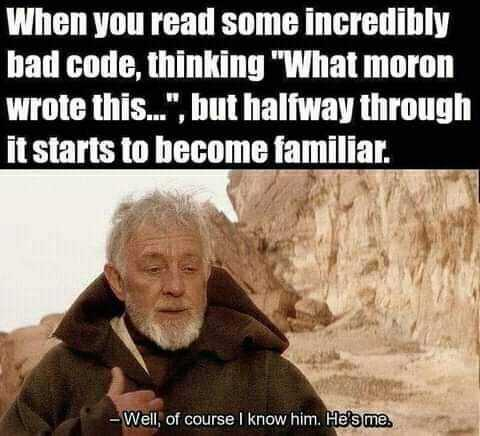

<h1>🌎 Hello Universe! 👋


</h1>


<!-- 💼 Software Developer II @ [One Origin](https://oneorigin.us/) -->

<!-- 💼 Engineer Consultant @ [Banyan Labs](https://banyanlabs.io/) -->

💼 Software Engineer @ [Dragon Cats Dev](https://DragonCats.dev/)

🔭 Currently working on my site v2.0

🌱 Currently learning Python & Ableton

❤️ I'm passionate about Chess

<!-- ⚡ Fun fact, I do sleep too -->

<!-- 🗨️ Ask me about open source collaborating -->

📫 Contact me [info here](https://www.joshmclain.com/#contact)

---

## Chess anyone?

This is an open chess tournament where ANYONE can play. That's the fun part.  
It's your turn to play! Move a <!-- BEGIN TURN -->white<!-- END TURN --> piece.

<!-- BEGIN CHESS BOARD -->
|   | A | B | C | D | E | F | G | H |   |
|---|:-:|:-:|:-:|:-:|:-:|:-:|:-:|:-:|:-:|
| **8** |  |  |  |  |  |  |  |  | **8** |
| **7** |  |  |  |  |  |  |  |  | **7** |
| **6** |  |  |  |  |  |  |  |  | **6** |
| **5** |  |  |  |  |  |  |  |  | **5** |
| **4** |  |  |  |  |  |  |  |  | **4** |
| **3** |  |  |  |  |  |  |  |  | **3** |
| **2** |  |  |  |  |  |  |  |  | **2** |
| **1** |  |  |  |  |  |  |  |  | **1** |
|   | **A** | **B** | **C** | **D** | **E** | **F** | **G** | **H** |   |
<!-- END CHESS BOARD -->

**It's your turn to move! Choose one from the following table**

<!-- BEGIN MOVES LIST -->
|  FROM  | TO (Just click a link!) |
| :----: | :---------------------- |
| **A2** | [A3](https://github.com/daemon-node-byte/daemon-node-byte/issues/new?body=Please+do+not+change+the+title.+Just+click+%22Submit+new+issue%22.+You+don%27t+need+to+do+anything+else+%3AD&title=Chess%3A+Move+A2+to+A3), [A4](https://github.com/daemon-node-byte/daemon-node-byte/issues/new?body=Please+do+not+change+the+title.+Just+click+%22Submit+new+issue%22.+You+don%27t+need+to+do+anything+else+%3AD&title=Chess%3A+Move+A2+to+A4) |
| **B1** | [A3](https://github.com/daemon-node-byte/daemon-node-byte/issues/new?body=Please+do+not+change+the+title.+Just+click+%22Submit+new+issue%22.+You+don%27t+need+to+do+anything+else+%3AD&title=Chess%3A+Move+B1+to+A3), [C3](https://github.com/daemon-node-byte/daemon-node-byte/issues/new?body=Please+do+not+change+the+title.+Just+click+%22Submit+new+issue%22.+You+don%27t+need+to+do+anything+else+%3AD&title=Chess%3A+Move+B1+to+C3) |
| **B2** | [B3](https://github.com/daemon-node-byte/daemon-node-byte/issues/new?body=Please+do+not+change+the+title.+Just+click+%22Submit+new+issue%22.+You+don%27t+need+to+do+anything+else+%3AD&title=Chess%3A+Move+B2+to+B3), [B4](https://github.com/daemon-node-byte/daemon-node-byte/issues/new?body=Please+do+not+change+the+title.+Just+click+%22Submit+new+issue%22.+You+don%27t+need+to+do+anything+else+%3AD&title=Chess%3A+Move+B2+to+B4) |
| **C2** | [C3](https://github.com/daemon-node-byte/daemon-node-byte/issues/new?body=Please+do+not+change+the+title.+Just+click+%22Submit+new+issue%22.+You+don%27t+need+to+do+anything+else+%3AD&title=Chess%3A+Move+C2+to+C3), [C4](https://github.com/daemon-node-byte/daemon-node-byte/issues/new?body=Please+do+not+change+the+title.+Just+click+%22Submit+new+issue%22.+You+don%27t+need+to+do+anything+else+%3AD&title=Chess%3A+Move+C2+to+C4) |
| **D1** | [E2](https://github.com/daemon-node-byte/daemon-node-byte/issues/new?body=Please+do+not+change+the+title.+Just+click+%22Submit+new+issue%22.+You+don%27t+need+to+do+anything+else+%3AD&title=Chess%3A+Move+D1+to+E2), [F3](https://github.com/daemon-node-byte/daemon-node-byte/issues/new?body=Please+do+not+change+the+title.+Just+click+%22Submit+new+issue%22.+You+don%27t+need+to+do+anything+else+%3AD&title=Chess%3A+Move+D1+to+F3), [G4](https://github.com/daemon-node-byte/daemon-node-byte/issues/new?body=Please+do+not+change+the+title.+Just+click+%22Submit+new+issue%22.+You+don%27t+need+to+do+anything+else+%3AD&title=Chess%3A+Move+D1+to+G4), [H5](https://github.com/daemon-node-byte/daemon-node-byte/issues/new?body=Please+do+not+change+the+title.+Just+click+%22Submit+new+issue%22.+You+don%27t+need+to+do+anything+else+%3AD&title=Chess%3A+Move+D1+to+H5) |
| **D2** | [D3](https://github.com/daemon-node-byte/daemon-node-byte/issues/new?body=Please+do+not+change+the+title.+Just+click+%22Submit+new+issue%22.+You+don%27t+need+to+do+anything+else+%3AD&title=Chess%3A+Move+D2+to+D3), [D4](https://github.com/daemon-node-byte/daemon-node-byte/issues/new?body=Please+do+not+change+the+title.+Just+click+%22Submit+new+issue%22.+You+don%27t+need+to+do+anything+else+%3AD&title=Chess%3A+Move+D2+to+D4) |
| **E1** | [E2](https://github.com/daemon-node-byte/daemon-node-byte/issues/new?body=Please+do+not+change+the+title.+Just+click+%22Submit+new+issue%22.+You+don%27t+need+to+do+anything+else+%3AD&title=Chess%3A+Move+E1+to+E2) |
| **F1** | [A6](https://github.com/daemon-node-byte/daemon-node-byte/issues/new?body=Please+do+not+change+the+title.+Just+click+%22Submit+new+issue%22.+You+don%27t+need+to+do+anything+else+%3AD&title=Chess%3A+Move+F1+to+A6), [B5](https://github.com/daemon-node-byte/daemon-node-byte/issues/new?body=Please+do+not+change+the+title.+Just+click+%22Submit+new+issue%22.+You+don%27t+need+to+do+anything+else+%3AD&title=Chess%3A+Move+F1+to+B5), [C4](https://github.com/daemon-node-byte/daemon-node-byte/issues/new?body=Please+do+not+change+the+title.+Just+click+%22Submit+new+issue%22.+You+don%27t+need+to+do+anything+else+%3AD&title=Chess%3A+Move+F1+to+C4), [D3](https://github.com/daemon-node-byte/daemon-node-byte/issues/new?body=Please+do+not+change+the+title.+Just+click+%22Submit+new+issue%22.+You+don%27t+need+to+do+anything+else+%3AD&title=Chess%3A+Move+F1+to+D3), [E2](https://github.com/daemon-node-byte/daemon-node-byte/issues/new?body=Please+do+not+change+the+title.+Just+click+%22Submit+new+issue%22.+You+don%27t+need+to+do+anything+else+%3AD&title=Chess%3A+Move+F1+to+E2) |
| **F2** | [F3](https://github.com/daemon-node-byte/daemon-node-byte/issues/new?body=Please+do+not+change+the+title.+Just+click+%22Submit+new+issue%22.+You+don%27t+need+to+do+anything+else+%3AD&title=Chess%3A+Move+F2+to+F3), [F4](https://github.com/daemon-node-byte/daemon-node-byte/issues/new?body=Please+do+not+change+the+title.+Just+click+%22Submit+new+issue%22.+You+don%27t+need+to+do+anything+else+%3AD&title=Chess%3A+Move+F2+to+F4) |
| **G1** | [E2](https://github.com/daemon-node-byte/daemon-node-byte/issues/new?body=Please+do+not+change+the+title.+Just+click+%22Submit+new+issue%22.+You+don%27t+need+to+do+anything+else+%3AD&title=Chess%3A+Move+G1+to+E2), [F3](https://github.com/daemon-node-byte/daemon-node-byte/issues/new?body=Please+do+not+change+the+title.+Just+click+%22Submit+new+issue%22.+You+don%27t+need+to+do+anything+else+%3AD&title=Chess%3A+Move+G1+to+F3), [H3](https://github.com/daemon-node-byte/daemon-node-byte/issues/new?body=Please+do+not+change+the+title.+Just+click+%22Submit+new+issue%22.+You+don%27t+need+to+do+anything+else+%3AD&title=Chess%3A+Move+G1+to+H3) |
| **G2** | [G3](https://github.com/daemon-node-byte/daemon-node-byte/issues/new?body=Please+do+not+change+the+title.+Just+click+%22Submit+new+issue%22.+You+don%27t+need+to+do+anything+else+%3AD&title=Chess%3A+Move+G2+to+G3), [G4](https://github.com/daemon-node-byte/daemon-node-byte/issues/new?body=Please+do+not+change+the+title.+Just+click+%22Submit+new+issue%22.+You+don%27t+need+to+do+anything+else+%3AD&title=Chess%3A+Move+G2+to+G4) |
| **H2** | [H3](https://github.com/daemon-node-byte/daemon-node-byte/issues/new?body=Please+do+not+change+the+title.+Just+click+%22Submit+new+issue%22.+You+don%27t+need+to+do+anything+else+%3AD&title=Chess%3A+Move+H2+to+H3), [H4](https://github.com/daemon-node-byte/daemon-node-byte/issues/new?body=Please+do+not+change+the+title.+Just+click+%22Submit+new+issue%22.+You+don%27t+need+to+do+anything+else+%3AD&title=Chess%3A+Move+H2+to+H4) |
<!-- END MOVES LIST -->

Having fun? Ask a friend to do the next move!

#### How it works

When you click on a link and submit a new issue with the desired move, a GitHub action is triggered, which in turn runs a small python script that performs the specified movement, updates this README file and commits the changes.

Have you spotted a bug? Something missing? Feel free to open an [issue](https://github.com/marcizhu/readme-chess/issues) and I will try to fix it as soon as possible :D

<details>
  <summary>Last 5 moves in this game</summary>
<!-- BEGIN LAST MOVES -->

| Move | Author |
| :--: | :----- |
| `E7` to `E5` | [ @mrmcgrain](https://github.com/mrmcgrain) |
| `E2` to `E4` | [ @daemon-node-byte](https://github.com/daemon-node-byte) |
| `Start game` | [ @daemon-node-byte](https://github.com/daemon-node-byte) |

<!-- END LAST MOVES -->
</details>

<details>
  <summary>Top 10 most moves across all games</summary>
<!-- BEGIN TOP MOVES -->

| Total moves |  User  |
| :---------: | :----- |
| 1 | [@daemon-node-byte](https://github.com/daemon-node-byte) |
| 1 | [@mrmcgrain](https://github.com/mrmcgrain) |

<!-- END TOP MOVES -->
</details>

---

Do you want to make your own? Check out [marcizhu/readme-chess](https://github.com/marcizhu/readme-chess)!

---

## 🧰 Toolbox

<p align="center">
  <a href="https://skillicons.dev">
    
  </a>
</p>

## 🏆 Trophies

<div align='center'>


  
<!--  -->
</div>

<div align=''>


<div>
</div>


<!--  -->
</div>

---

<details>
<summary>

## 🕥 Wakatime record since Feb, 2023

</summary>

<!--START_SECTION:waka-->


**🐱 My GitHub Data**

> 📦 952.9 kB Used in GitHub's Storage
>
> 💼 Opted to Hire
>
> 📜 16 Public Repositories
>
> 🔑 64 Private Repositories
>
> **I'm a Night 🦉**

```text
🌞 Morning                88 commits          ███░░░░░░░░░░░░░░░░░░░░░░   13.71 %
🌆 Daytime                99 commits          ████░░░░░░░░░░░░░░░░░░░░░   15.42 %
🌃 Evening                287 commits         ███████████░░░░░░░░░░░░░░   44.70 %
🌙 Night                  168 commits         ███████░░░░░░░░░░░░░░░░░░   26.17 %
```

📅 **I'm Most Productive on Monday**

```text
Monday                   131 commits         █████░░░░░░░░░░░░░░░░░░░░   20.40 %
Tuesday                  73 commits          ███░░░░░░░░░░░░░░░░░░░░░░   11.37 %
Wednesday                62 commits          ██░░░░░░░░░░░░░░░░░░░░░░░   09.66 %
Thursday                 61 commits          ██░░░░░░░░░░░░░░░░░░░░░░░   09.50 %
Friday                   70 commits          ███░░░░░░░░░░░░░░░░░░░░░░   10.90 %
Saturday                 127 commits         █████░░░░░░░░░░░░░░░░░░░░   19.78 %
Sunday                   118 commits         █████░░░░░░░░░░░░░░░░░░░░   18.38 %
```

📊 **This Week I Spent My Time On**

```text
🕑︎ Time Zone: America/Phoenix

💬 Programming Languages:
Python                   8 mins              █████████████████████████   100.00 %

🔥 Editors:
VS Code                  8 mins              █████████████████████████   100.00 %

💻 Operating System:
Mac                      8 mins              █████████████████████████   100.00 %
```

**I Mostly Code in TypeScript**

```text
TypeScript               28 repos            ██████████░░░░░░░░░░░░░░░   38.36 %
Vue                      7 repos             ██░░░░░░░░░░░░░░░░░░░░░░░   09.59 %
Svelte                   3 repos             █░░░░░░░░░░░░░░░░░░░░░░░░   04.11 %
Java                     2 repos             █░░░░░░░░░░░░░░░░░░░░░░░░   02.74 %
Python                   2 repos             █░░░░░░░░░░░░░░░░░░░░░░░░   02.74 %
```

Last Updated on 31/03/2025 18:47:47 UTC

<!--END_SECTION-->

</details>

---

---

<details>
<summary>

## 🎧 Dev Environment

</summary>

> ### _I'm not a player 🐱 I just code a lot..._

<div align='center'>
<!--  -->

</div>
</details>

<!-- ## Memes

who doesn't love memes? -->

<div align='center'>



</div>

<!-- <div align='center'>

</div> -->
